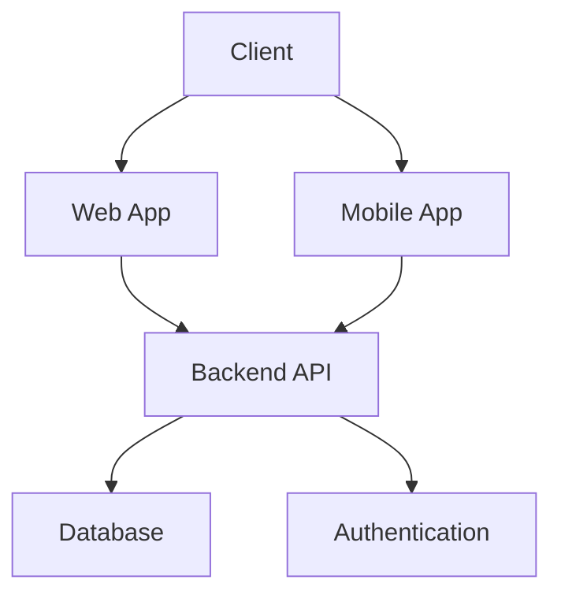

# Idea by Ahmed Soliman

# Gannat startup company

Startup Documentation
Cross-Platform Web & Mobile Application Development Company
1. Overview of the Company

Company Name: Gannat
Industry: Software Development / IT Services
Focus: Web Applications & Cross-platform Mobile Applications

Target Market: Start-ups, SMEs, enterprises, and individuals

Mission Statement

The mission is to deliver high-quality, scalable, and cost-effective web and mobile applications using modern cross-platform technologies.

Vision Statement

To become a trusted technology partner for businesses from all over the world, crafting solid, innovative, user-friendly digital products.

2. Problem Statement

The common battles of any business are hereby listed:

High development cost for separate Android, iOS, and web applications.

Long development timelines

Multi-platform maintenance complexity

Difficulty in finding skilled developers who can deliver an end-to-end solution.

3. Solution

Our company provides cross-platform web and mobile application development and enables clients to:

Build once and deploy everywhere

Reduce cost, development time

Maintain one codebase

Easily scale applications

4. Services Offered

4.1 Web Application Development

Responsive web applications

Progressive Web Apps - PWA

Admin dashboards and portals

SaaS platforms

4.2 Cross-Platform Mobile Application Development

Android & iOS apps from a single codebase

MVP development for startups

Mobile enterprise solutions

4.3 Backend & API Development

REST & GraphQL APIs

Authentication & authorization

Database

## Technology Stack

## Services Overview

### Web Application Development

### Mobile Application Development

### Backend Development
